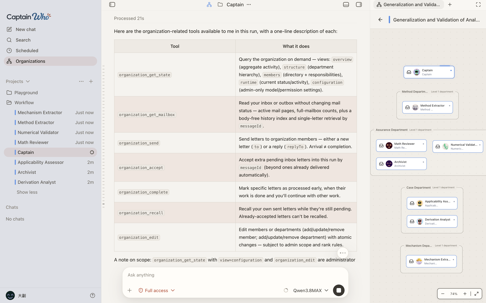

# Captain Who: Scenario Gallery

[English overview](README.md) · [简体中文](README.zh-CN.md)

A closer look at research, writing, code review, browser interaction, and collaboration in Captain Who. Screenshots are examples of the interface, not evidence that a task or its results have been independently verified. Their language, model names, settings, and layout may differ from your installed version.

Full-access modes shown here are not a recommendation; start with default permissions and review approvals. Displayed token counts, cache hit rates, and costs are example local statistics, not benchmarks or provider bills.

## Research a topic with parallel subagents

The example presentation task divides research on university history, academic research, notable people, and rankings among four subagents. The panel lets you inspect their progress; the resulting claims still need source checks.

The conversation shows an AI-generated campus illustration for the presentation, alongside subagent activity. This is generated artwork, not a photograph of a real campus or a verified architectural reference.

[Research and writing tutorial](public-docs/user/tutorials/research-and-write.md) · [Multi-Agent tutorial](public-docs/user/tutorials/use-multiple-agents.md)

## Coordinate independent conversations in an organization

The organization view brings member conversations and a shared board together. Members keep independent conversations and exchange tasks and results through internal mail; this is separate from a conversation's temporary subagent tree. The screenshot illustrates the interface and mail tools, not a completed research result.

**Development-version feature:** organization behavior documented here is verified in the current development code, not guaranteed in every website installer. Current organizations do not use fixed execution wires or input/output gates. See the [organization guide](public-docs/user/capabilities/organizations.md) and [two-member research tutorial](public-docs/user/tutorials/create-an-organization.md).

## Review files and code beside the conversation

Review a proposed code change while keeping the conversation and project terminal visible.

Read a Markdown file alongside the discussion and inspect usage for an individual response. This is a Markdown preview; Word, Excel, and PowerPoint files cannot be previewed directly in the Files panel.

More: project conversations and chat commands

Choose the conversation's model and check its permission mode before starting a task.

Use `/` to access model selection, context compaction, and conversation actions.

## Inspect a webpage and hand control back when needed

Discuss the currently displayed webpage and its dialog without leaving the workspace.

The assistant requests user action at a website sign-in page. Complete authentication yourself; do not put passwords or verification codes into the conversation.

[Search and browser guide](public-docs/user/everyday-use/search-and-browser.md)

## Gather structured input

An MBTI-style questionnaire demonstrates question cards with choices and custom answers. The example is an interface demonstration, not a validated psychological assessment.

## Configure the tools and boundaries for a task

Skills, local MCP servers, and subagent templates

Install reusable task instructions and resources from GitHub or an authorized local folder. Review the source before installing.

Check local MCP server status and enable the tools needed for a task. The current product supports local stdio servers; the listed examples do not imply support for every MCP transport or feature.

Save a specialist role, choose its model, and assign the template to a project.

Permissions and model API configuration

Review file-access scope and approval rules. Default permissions are the starting point; a full-access selection in an example does not make it appropriate for your task.

Configure a model connection and the prices used for local estimates. The API token is masked in this example. Keep credentials in settings and out of shared screenshots or conversations.

Usage estimates and appearance

Inspect local usage by model and date. These values describe this example's activity; they are not performance guarantees or a substitute for your provider's bill.

Choose a theme and inspect its code-diff colors before adjusting other display preferences.

[Capability limits](public-docs/user/reference/capability-limits.md) · [Safe agent usage](public-docs/user/best-practices/safe-agent-usage.md)

Historical interface: the retired visual workflow

This early interface used connected workflow nodes. That workflow feature has been removed; this is not the current organization interface or its execution model. Current organizations use independent member conversations and internal mail, as shown above.

---

[Back to the English overview](README.md) · [返回中文介绍](README.zh-CN.md)
