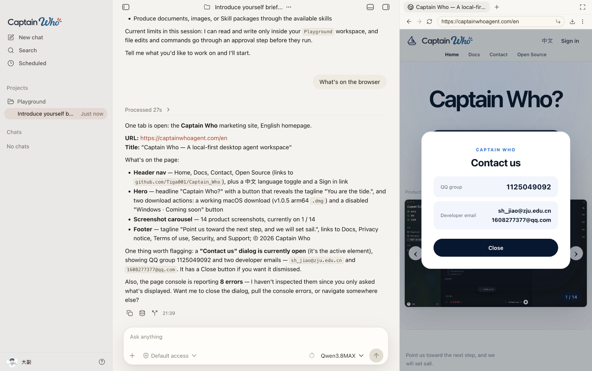

# Captain Who: Screenshot Gallery

[Back to README](README.md)

All 26 supplied images are listed in upload order, with short English captions. Screenshots retain their original interface language and have not been edited. Repeated uploads have separate entries but reuse the same image file.

## Batch 1

### 01. 67346.PNG

*Track a presentation task while four research sub-agents work in parallel.*

### 02. 67350.PNG

*Generate presentation artwork while monitoring active and completed research sub-agents.*

### 03. 67351.PNG

*Chat in a project workspace with model and permission controls in the composer.*

### 04. 67354.PNG

*Review code changes beside the conversation and an integrated workspace terminal.*

### 05. 67355.PNG

*Configure workspace access and approval rules for file edits, commands, and built-in tools.*

### 06. 67356.PNG

*Choose a theme and preview its code-diff styling.*

### 07. 67357.PNG

*Enable sub-agents and manage reusable specialist templates.*

### 08. 67358.PNG

*Install skills from GitHub or a local folder and manage built-in capabilities.*

## Batch 2

### 09. 67363.PNG

*Use chat commands to switch models, compress context, and manage conversations.*

### 10. d41fa0840a45066449f4c6fb6cace9e0.PNG

*Preview a Markdown document beside chat and inspect per-message token usage.*

### 11. Eng-github-social-preview.jpg

*Inspect a webpage in the built-in browser without leaving the conversation.*

### 12. Eng.png

*Inspect a webpage in the built-in browser without leaving the conversation.*

### 13. Eng2.png

*Inspect a visual workflow linking a coordinator, copy editors, and a reviewer.*

### 14. IMG_9887.JPG

*Pause browser automation for the user to complete a website sign-in.*

## Batch 3

### 15. 67357(1).PNG

*Enable sub-agents and manage reusable specialist templates.*

Repeated upload of image 07.

### 16. 67358(1).PNG

*Install skills from GitHub or a local folder and manage built-in capabilities.*

Repeated upload of image 08.

### 17. 67359.PNG

*Manage local MCP servers and see which integrations are ready.*

### 18. 67360.PNG

*Track token usage, cache hits, and estimated costs by model and time range.*

### 19. 67361.PNG

*Configure a model's endpoint, context window, token pricing, and image input.*

### 20. 67362.PNG

*Collect structured answers with an interactive, multi-step question card.*

## Batch 4

### 21. 67346(1).PNG

*Track a presentation task while four research sub-agents work in parallel.*

Repeated upload of image 01.

### 22. 67350(1).PNG

*Generate presentation artwork while monitoring active and completed research sub-agents.*

Repeated upload of image 02.

### 23. 67351(1).PNG

*Chat in a project workspace with model and permission controls in the composer.*

Repeated upload of image 03.

### 24. 67354(1).PNG

*Review code changes beside the conversation and an integrated workspace terminal.*

Repeated upload of image 04.

### 25. 67355(1).PNG

*Configure workspace access and approval rules for file edits, commands, and built-in tools.*

Repeated upload of image 05.

### 26. 67356(1).PNG

*Choose a theme and preview its code-diff styling.*

Repeated upload of image 06.

